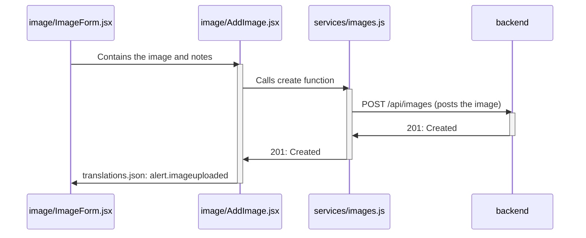
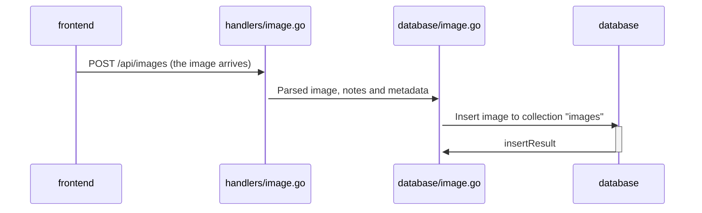

This is how uploading an image goes through the frontend:

```mermaid
    sequenceDiagram

    participant image/ImageForm.jsx
    participant image/AddImage.jsx
    participant services/images.js
    participant backend

    image/ImageForm.jsx ->> image/AddImage.jsx: Contains the image and notes
    activate image/AddImage.jsx
    
    image/AddImage.jsx ->> services/images.js: Calls create function
    activate services/images.js

    services/images.js ->> backend: POST /api/images (posts the image)
    activate backend
    backend ->> services/images.js: 201: Created
    deactivate backend

    services/images.js ->> image/AddImage.jsx: 201: Created
    deactivate services/images.js

    image/AddImage.jsx ->> image/ImageForm.jsx: translations.json: alert.imageuploaded
    deactivate image/AddImage.jsx

```

And this is how uploading an image goes through the backend:

```mermaid
    sequenceDiagram

    participant frontend
    participant handlers/image.go
    participant database/image.go
    participant database

    frontend ->> handlers/image.go: POST /api/images (the image arrives)
    activate handlers/image.go

    handlers/image.go ->> database/image.go: Parsed image, notes and metadata
    activate database/image.go

    database/image.go ->> database: Insert image to collection "images"
    activate database
    database ->> database/image.go: insertResult
    deactivate database
     
    
```