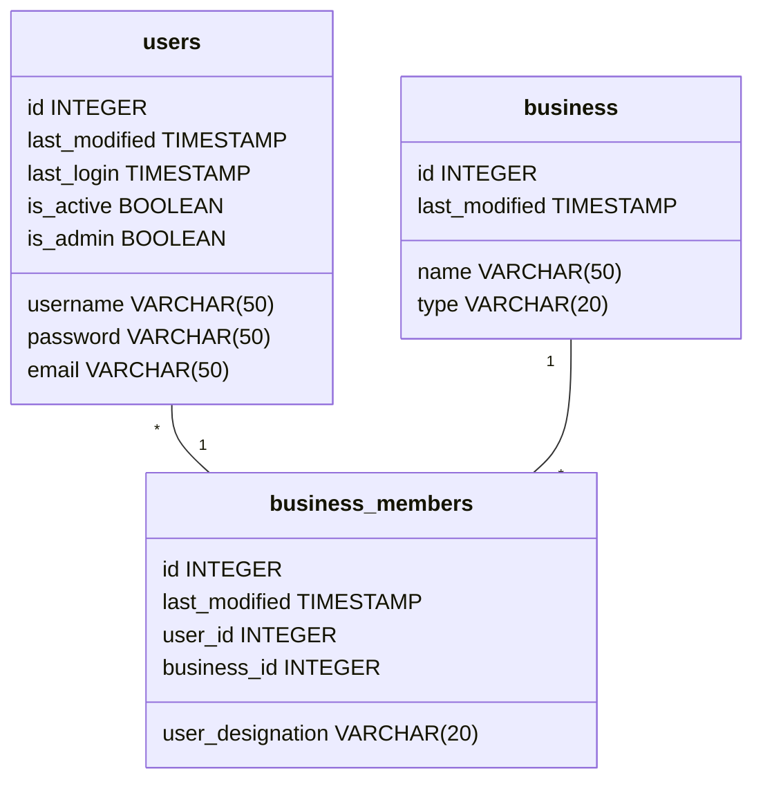

# SQL-database schema



Some definitions:
- business.type = either "growing" or "retailing"
- business_members.user_designation = either "owner" or "employee"

Table users can be used in registration, login and user permission authentications. Table business_members can be used in determining which business site to show to certain user. User role (grower or retailer) can be found from business.type through business_members and owner status straight from business_members. Data stored in user.last_login can be used in determining inactivity. Every table has last_modified, which can be used for general housekeeping. Table users has is_admin in preparation for future admin role.

```SQL
CREATE TABLE users (
    id SERIAL PRIMARY KEY,
    last_modified TIMESTAMP,
    last_login TIMESTAMP,
    username VARCHAR(50),
    password VARCHAR(50),
    email VARCHAR(50) UNIQUE,
    is_active BOOLEAN,
    is_admin BOOLEAN
);

CREATE TABLE business (
    id SERIAL PRIMARY KEY,
    last_modified TIMESTAMP,
    name VARCHAR(50) UNIQUE,
    type VARCHAR(20)
);

CREATE TABLE business_members (
    id SERIAL PRIMARY KEY,
    last_modified TIMESTAMP,
    user_id INTEGER REFERENCES users,
    business_id INTEGER REFERENCES business,
    designation VARCHAR(20)
);
```
